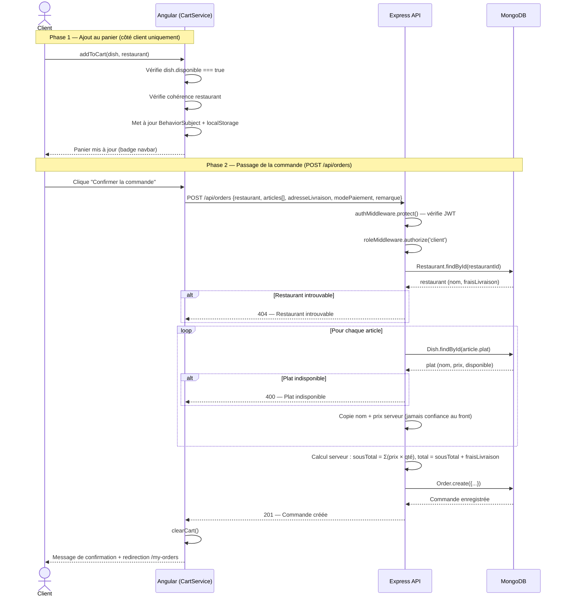
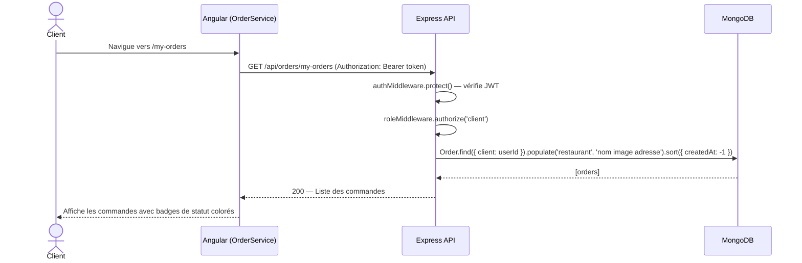

# Diagrammes de séquence — Module Commandes Client

## Scénario 1 : Ajout au panier et passage d'une commande

```mermaid
sequenceDiagram
    actor Client
    participant Angular as Angular (CartService)
    participant API as Express API
    participant DB as MongoDB

    Note over Client, Angular: Phase 1 — Ajout au panier (côté client uniquement)

    Client->>Angular: addToCart(dish, restaurant)
    Angular->>Angular: Vérifie dish.disponible === true
    Angular->>Angular: Vérifie cohérence restaurant
    Angular->>Angular: Met à jour BehaviorSubject + localStorage
    Angular-->>Client: Panier mis à jour (badge navbar)

    Note over Client, DB: Phase 2 — Passage de la commande (POST /api/orders)

    Client->>Angular: Clique "Confirmer la commande"
    Angular->>API: POST /api/orders {restaurant, articles[], adresseLivraison, modePaiement, remarque}
    API->>API: authMiddleware.protect() — vérifie JWT
    API->>API: roleMiddleware.authorize('client')

    API->>DB: Restaurant.findById(restaurantId)
    DB-->>API: restaurant (nom, fraisLivraison)
    alt Restaurant introuvable
        API-->>Angular: 404 — Restaurant introuvable
    end

    loop Pour chaque article
        API->>DB: Dish.findById(article.plat)
        DB-->>API: plat (nom, prix, disponible)
        alt Plat indisponible
            API-->>Angular: 400 — Plat indisponible
        end
        API->>API: Copie nom + prix serveur (jamais confiance au front)
    end

    API->>API: Calcul serveur : sousTotal = Σ(prix × qté), total = sousTotal + fraisLivraison
    API->>DB: Order.create({...})
    DB-->>API: Commande enregistrée
    API-->>Angular: 201 — Commande créée

    Angular->>Angular: clearCart()
    Angular-->>Client: Message de confirmation + redirection /my-orders
```

## Scénario 2 : Consultation de l'historique des commandes

```mermaid
sequenceDiagram
    actor Client
    participant Angular as Angular (OrderService)
    participant API as Express API
    participant DB as MongoDB

    Client->>Angular: Navigue vers /my-orders
    Angular->>API: GET /api/orders/my-orders (Authorization: Bearer token)

    API->>API: authMiddleware.protect() — vérifie JWT
    API->>API: roleMiddleware.authorize('client')

    API->>DB: Order.find({ client: userId }).populate('restaurant', 'nom image adresse').sort({ createdAt: -1 })
    DB-->>API: [orders]

    API-->>Angular: 200 — Liste des commandes

    Angular-->>Client: Affiche les commandes avec badges de statut colorés
```
